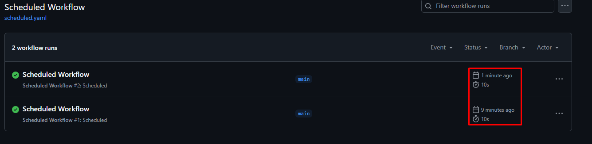
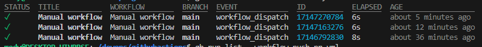
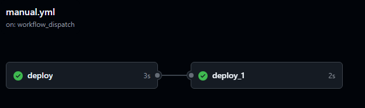
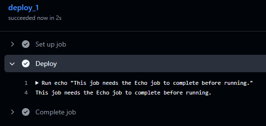
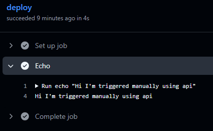
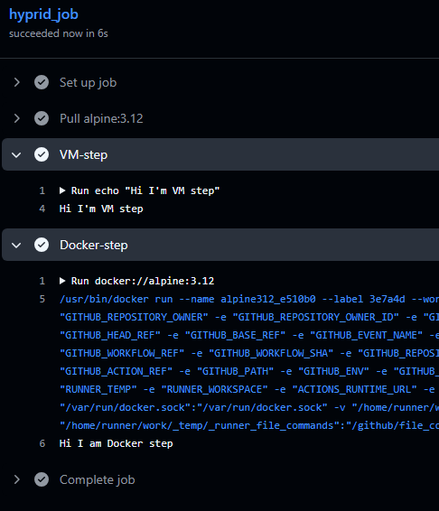

# Github Actions Study

This is a simple toturial, and study of how github actions work.

This readme is a study note and it is going to be inhanced and updated periodecally.

* Some commits were due accessing git from wsl and vscode:
    you need to add your git path `/usr/bin/git` into `git.path` -search for it in vscode settings-

Generally you can specify the branch you want your workflow to run in. Also, depends on specific change in specific dir no the whol git repo.

## On push
`on.push:`
Only after pushing the changes

## Scheduled workflow
`on.schedule:`
It's used to scheduel a specific workflow not related to any action: soething like checking the code or generating a report periodecally.

But, from the next screenshot it seems it is not repeat the scheduled job befor less than 10 minutes.


I'm truning it to run once a year.
"0 0 1 1 *"

## Manual Workflow
`on.workflow_dispatch:`
Could be push button, api call, or some other things.

You can also run it with gh cli command. 
Here I'm using ubunut24.04 WSL:

```bash
sudo apt install gh
gh auth login
## Follow the steps then enter the code to verifiy you identity.

# Run the workflow
gh workflow run "Manual workflow"
✓ Created workflow_dispatch event for manual.yml at main

To see runs for this workflow, try: gh run list --workflow=manual.yml

gh run list --workflow=manual.yml
```


We can apply step dependancy by adding `needs` 
```yaml
jobs:
    job_2:
      needs: job_1
```




`on.repository_dispatch:`
Purpose is to trigger the workflow manually responding to api specific call.
You need to focus on type of event you put in the workflow in my case it's `deploy`:
```yaml
on:
  repository_dispatch:
    types: [deploy]
```

Now you need to generate an api token. Go to up right > Settings > developper setteings > PAT
Add a permission checkbox "workflow"

then for security export it in a variable in your terminal:

```bash
export GITHUB_PAT=<PAT>
 curl -X POST \
-H "Authorization: token $GITHUB_PAT" \
-H "Accept: application/vnd.github.v3+json" \
https://api.github.com/Mohammadabdelaty/githubactions/dispatches \
-d '{"event_type": "deploy"}'
```
Then check your workflow:




# Step in container
In this case instaead of direct run we add `uses:`
```yaml
      - name: Docker-step
        uses: docker://alpine:3.12
        with:
          entrypoint: /bin/sh
          args: |
            -c "echo 'Hi I am Docker step'"
```

